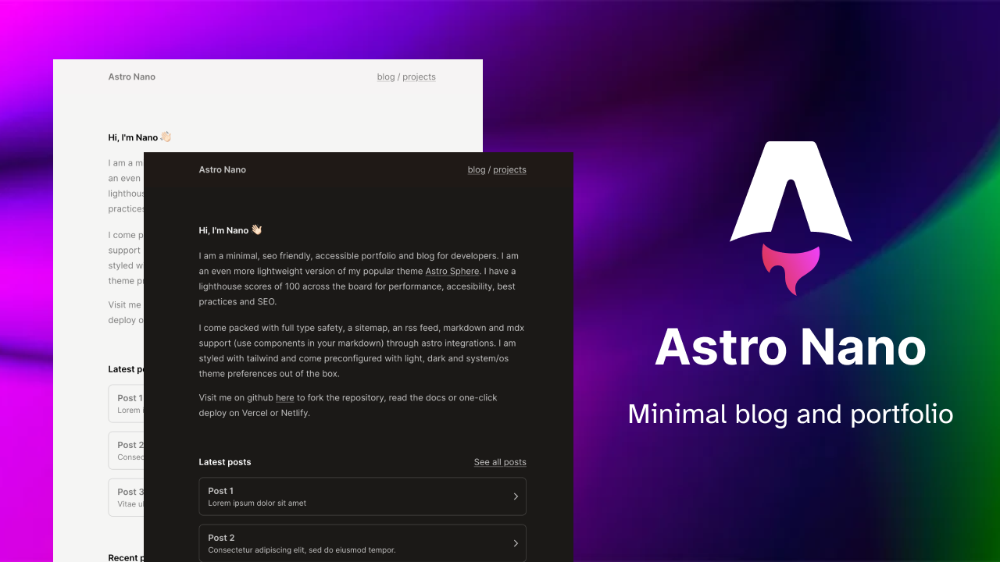

# Hotteano Blog ✦

[](https://astro.build)
[](https://vercel.com/new/clone?repository-url=https://github.com/hotteano/hotteano.github.io)

> 一个现代化的个人博客，使用 Astro 构建，具有灵动的动画特效。



## ✨ 特性

- ✅ **100/100 Lighthouse 评分** - 极致性能体验
- ✅ **响应式设计** - 完美适配各种设备
- ✅ **无障碍访问** - 遵循 WCAG 标准
- ✅ **SEO 友好** - 自动生成 Sitemap 和 RSS
- ✅ **类型安全** - TypeScript 全栈支持
- ✅ **极简风格** - 优雅大方的设计
- ✅ **明暗主题** - 支持亮色/暗色/系统主题
- ✅ **灵动动画** - 打字机效果、粒子背景、滚动动画
- ✅ **Tailwind CSS** - 原子化 CSS 框架
- ✅ **MDX 支持** - 在 Markdown 中使用组件

## 🚀 快速开始

### 本地开发

```bash
# 克隆项目
git clone https://github.com/hotteano/hotteano.github.io.git
cd hotteano.github.io

# 安装依赖
npm install

# 启动开发服务器
npm run dev
```

访问 `http://localhost:4321` 查看你的网站。

### 构建

```bash
npm run build
```

构建后的文件将在 `dist/` 目录中。

## 📝 内容管理

### 添加博客文章

在 `src/content/blog/` 目录下创建新的文件夹和 `index.md` 文件：

```markdown
---
title: "文章标题"
summary: "文章摘要"
date: "2026-02-17"
draft: false
tags:
  - 标签1
  - 标签2
---

文章内容使用 Markdown 格式...
```

### 添加项目

在 `src/content/projects/` 目录下创建项目文件，格式与博客文章相同。

### 更新个人信息

编辑 `src/consts.ts` 文件来更新站点信息：

```typescript
export const SITE: Site = {
  NAME: "你的名称",
  EMAIL: "your.email@example.com",
  // ...
};
```

## 🎨 动画效果

本博客包含多种精心设计的动画效果：

| 动画 | 描述 | 位置 |
|------|------|------|
| 打字机效果 | 逐字显示的文字动画 | 首页标题 |
| 粒子背景 | 鼠标交互的粒子连线 | 全页面背景 |
| 滚动触发 | 元素进入视口时的淡入动画 | 各区块 |
| 磁性按钮 | 鼠标跟随的按钮效果 | 所有按钮 |
| 悬浮效果 | 悬停时轻微上浮 | 卡片组件 |
| 渐变动画 | 流动的渐变色 | 标题文字 |

## 📂 项目结构

```
├── src/
│   ├── components/     # 可复用组件
│   │   ├── Typewriter.astro      # 打字机效果
│   │   ├── ParticleBackground.astro  # 粒子背景
│   │   └── ...
│   ├── content/        # 内容集合
│   │   ├── blog/       # 博客文章
│   │   ├── projects/   # 项目展示
│   │   └── work/       # 工作经历
│   ├── layouts/        # 页面布局
│   ├── pages/          # 页面路由
│   ├── styles/         # 全局样式
│   └── consts.ts       # 站点配置
├── public/             # 静态资源
└── astro.config.mjs    # Astro 配置
```

## 🛠️ 技术栈

- **[Astro](https://astro.build/)** - 现代静态站点生成器
- **[Tailwind CSS](https://tailwindcss.com/)** - 实用优先的 CSS 框架
- **[TypeScript](https://www.typescriptlang.org/)** - 类型安全的 JavaScript
- **[MDX](https://mdxjs.com/)** - 增强型 Markdown

## 📄 许可证

[MIT](./LICENSE) © Hotteano

---

用 ❤️ 构建于 Astro
