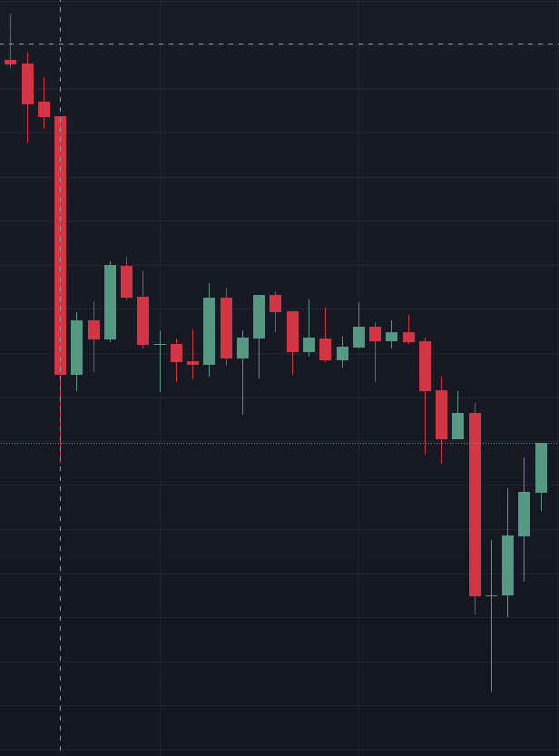
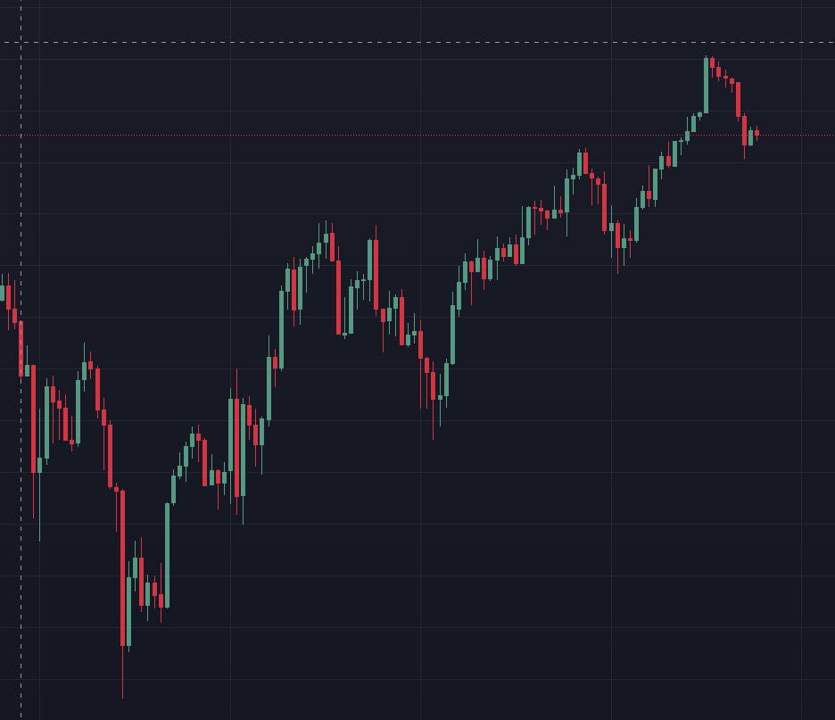
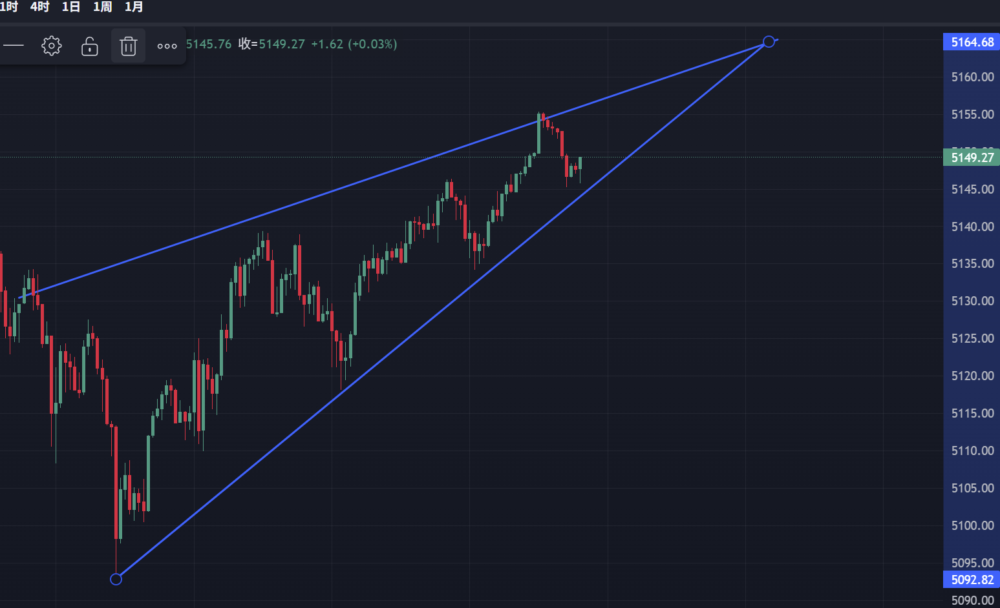

## 目前持仓

**持仓类型：** 中行如意金
**持仓成本：** 11504.2 RMB
**持仓克数：** 10 g
**持仓均价：** 1150 RMB

## 金价局面分析（人民币价格：如意金；价格走势：伦敦金）

**现价：** 1141 RMB
**收益比例：** -0.782%
<!-- **今日走势：**

 -->

**价格分析：** 今日金价大幅高开，并在沪金开盘后迅速跳水，表明资金获利盘套利了结及散户解套抛盘；经过长时间盘整之后，进入第二次下跌行情，估计为空头开出空单并做空黄金获利，后续多头入场迅速做高黄金，显示强力底价支撑。底部呈现绿色（此处，上涨为绿色）十字星，表明多空竞价激烈，且多头取得胜利，空头了结离场。

**底价分析：** 目前注意到5100美元/金衡盎司附近存在强力支撑，不宜继续做空；目前多头呈现出拉升态势。

<!-- **上升行情：**

 -->

**上升行情分析：** 价格呈现出上升通道，多头力量明显强于空头力量。

<!--  -->

**上升通道估计：** 上升通道终点为5164.86美元/金衡盎司，此后将出现多空分歧。

**消息面分析：**

- 美元指数上涨，利空
- 美联储认为AI热潮将会促进中性利率上升，迫使美联储收紧货币政策，加息；但是如果AI造成了失业率加剧和贫富分化，可能导致货币政策放松
- 伊朗方面，尽管双方表现出外交谈判解决问题的意愿，但是事实上大概率是烟雾弹。一方面，美国集结兵力已经达到海湾战争等级，美国必须从中获利，否则会影响特朗普中期选举结果（国会将会质询军事调动的必要性）；另一方面，以色列不会允许伊朗继续持有中远程弹道导弹和核弹，以色列有极强的意愿推动美国与伊朗发生战争。从美国近期的军事调动来看，至少会发生长达一到两周的短期战争，若美国以压倒性优势胜利，则伊朗政府倒台，石油面临涨价危机，推动避险资产上涨；若美国失败，市场将会担忧美国政府债务扩张的风险，进而推高黄金。总而言之，黄金近一个月具有强烈的上涨趋势，除非伊朗与美国达成某些协议。